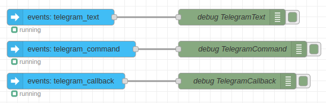
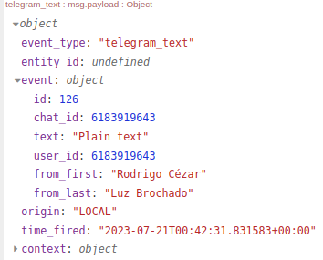
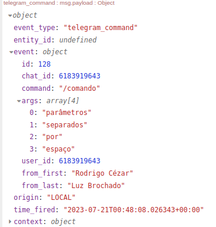
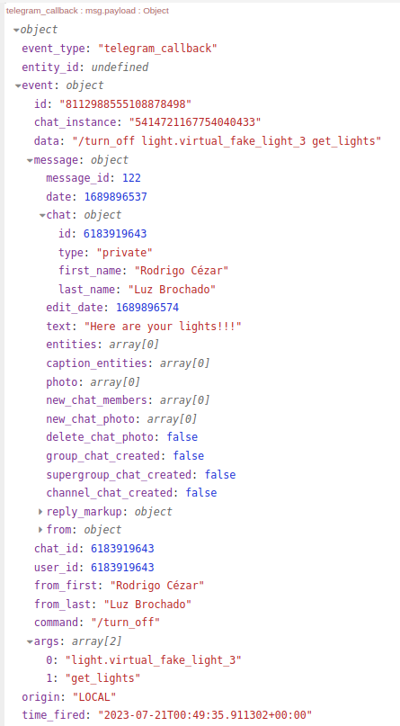
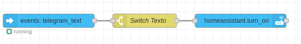
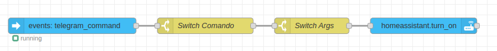
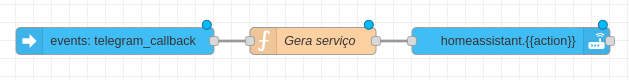
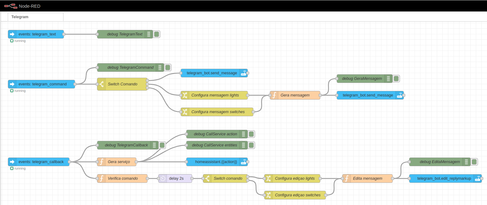

<td style="width: 20%;"></td>
<p><strong><span style="color: #0000ff;">Home Assistant- Telegram</strong></p>
<p><strong><span style="color: #0000ff;">Prof Epaminondas Lage</span></strong></p>
<a href="http://lattes.cnpq.br/7787341723868111"> Currículo Lattes LAGE, E. S.</a>

# Índice

- [Sites relacionados ao Home Assistant e Telegram ](#Sites-relacionados-ao-Home-Assistant-e-Telegram)
- [Introdução](#Introdução)
- [Repositório Disponível](#Repositório-Disponível)
- [Status do Projeto](#Status-do-Projeto)

# Sites relacionados ao Home Assistant e Telegram

- Documentação oficial da integração do Telegram com Home assistant: https://www.home-assistant.io/integrations/telegram/
- Documentação oficial dos serviços de notificação do Telegram com Home assistant: https://www.home-assistant.io/integrations/telegram_bot
- Documentação do **node-red-contrib-home-assistant-websocket** (modulo do Home Assistant para Node RED): https://zachowj.github.io/node-red-contrib-home-assistant-websocket/guide/

# Introdução

A integração do Telegram é bastante util para controlar e receber eventos do Home Assistant, especialmente quando o usuario esta fora do alcance de sua rede local e nao possui uma VPN. Atraves dela pode-se enviar comandos e receber notificações do Home Assistant em uma conversa do aplicativo Telegram, permitindo o controle e monitoramento remoto das automações. Para facilitar o projeto das automações, este tutorial utiliza o Node RED, uma ferramenta de desenvolvimento baseada em fluxo para programação visual.

# Instalação

Para criar e configurar o seu primeiro bot do Telegram, siga os passos a seguir:

1. **Crie um bot do telegram:**
   - No aplicativo do Telegram, abra um chat com o @BotFather.
   - Digite /newbot.
   - Siga as instruções na tela e dê um nome ao seu bot.
   - O BotFather fornecerá um link para seu novo bot e um token de API HTTP.
   - Guarde o token em algum lugar seguro. Se for salva-lo em um arquivo dentro de seu projeto, membre-se de nao deixa-lo em um github publico, qualquer um com acesso a esse token pode controlar o seu bot.
2. **Obtenha o seu ID de usuario:**
   - Para obter o ID de conversa do seu usuario, abra um chat com o bot GetIDs.
   - Em seguida, digite /start. O bot retornará seu ID de conversa e nome de usuário.
3. **Associe o seu bot do Telegram ao Home Assistant:**

   - Cole o codigo abaixo no seu **configuration.yaml**. Lembre-se de substituir os valores dos campos **api_key** e **allowed_chat_ids** pelos seus dados obtidos nos passos anteriores.

   ```yaml
   # Telegram Bot
   telegram_bot:
     - platform: polling
       api_key: "1117774004:EABQulCACdgkQOTN3hS_5HZwSwxDlekCixr"
       allowed_chat_ids:
         - 44441111
   ```

4. **Crie um notificador:**

   - Cole o codigo abaixo no seu **configuration.yaml**. Lembre-se de substituir os valores dos campos **name** e **chat_id** pelos seus dados obtidos nos passos anteriores. Este codigo por exemplo, cria o serviço **notify.epaminondas** que envia uma mensagem de telegram para o usuario Epaminondas.

   ```yaml
   # Notifier
   notify:
     - platform: telegram
       name: "epaminondas"
       chat_id: 12345678
   ```

5. **Reinicie o Home Assistant para que as mudanças façam efeito.**
6. **Teste o seu bot:**

   - Na conversa com BotFather, selecione o link para abrir um chat com seu novo bot.
   - Os bots não têm permissão para entrar em contato com os usuários. Você precisa fazer o primeiro contato do usuário para o qual deseja configurar o bot. No chat com o novo bot, digite /start.
   - No Home Assistant, vá para **Ferramentas do desenvolvedor > Serviços > Modo YAML**
   - Cole o codigo abaixo no arquivo YAML. Lembre-se de substituir **notify.epaminondas** pelo serviço de notificação criado anteriormente.

   ```yaml
   service: notify.epaminondas
   data:
     message: "Que legal! Uma messagem do Home Assistant!"
   ```

   - Clique no botão **INICIAR SERVIÇO** para enviar a mensagem.

# Criando o bot

## Nodos uteis do Node RED para esta automação

O Node RED é uma ferramenta muito util para fazer automações no Home Assistant que requerem um nivel maior de complexidade. Através dele podemos descrever visualmente um fluxo complexo e acompanhar visualmente o que ocorre em cada nodo, facilitando o debug de eventuais problemas. Abaixo segue uma lista e breve descrição de nodos uteis do Node RED que serão utilizados neste tutorial, incluindo tanto nodos gerais nativos do Node RED quanto nodos pertencentes à integração com o Home Assistant.

### Nodos gerais

- **change**: utilizado para modificar as propriedades de uma mensagem e definir propriedades de contexto sem a necessidade de recorrer a um nodo **function**.
- **debug**: usado para exibir mensagens na barra lateral Debug dentro do editor. Facilita o entendimento das propriedades das mensagens recebidas e confirmação de que as alterações estão corretas.
- **delay**: adiciona um atraso no fluxo, conglando a execução por um periodo de tempo.
- **function**: permite que a execução de código JavaScript para modificar uma mensagem, facilitando a aplicação de operações complexas.
- **switch**: permite que as mensagens sejam roteadas para diferentes ramificações de um fluxo de acordo com um conjunto de regras.

### Nodos especificos do Home Assistant

- **call_service**: permite o acionamento de um serviço do Home Assistant a partir de um fluxo do Node RED.
- **events: telegram_text**: Recebe eventos do Home Assistant de tipo telegram_text.
- **events: telegram_command**: Recebe eventos do Home Assistant de tipo telegram_command.
- **events: telegram_callback**: Recebe eventos do Home Assistant de tipo telegram_callback.

Nas imagens abaixo podemos ver a estrutura das mensagens recebidas quando os eventos do Telegram são disparados pelo Home Assistant.



Ao receber mensagens simples iniciadas pelo usuario, o evento **telegram_text** é disparado. Como podemos ver na imagem, o texto enviando fica em **msg.payload.event.text**.



Ao receber mensagens iniciadas pelo usuario que comecem com o caracter **/**, o evento **telegram_command** é disparado. Como podemos ver na imagem, o comando enviando fica em **msg.payload.event.command**. Qualquer palavra enviada apos o comando é tratada como um parametro deste comando e é armazenada em um _array_ em **msg.payload.event.args**.



Ao receber mensagens iniciadas a partir de uma interação do usuario com uma ação predeterminada (como clicar em um botão do **inline_keyboard**), o evento **telegram_callback** é disparado. Nesta categoria, a mensagem recebida possui, além dos campos habituais, uma referencia à mensagem que gerou o callback (**msg.payload.event.message.message_id** e msg.payload.event.message.chat.id). Esta referencia pode ser utilizada para editar a mensagem.



Mais detalhes podem ser encontrados na documentação oficial da integração do Telegram com Home assistant: https://www.home-assistant.io/integrations/telegram/

## Automação simples com comandos

### Utilizando Plain Text

A imagem abaixo mostra um exemplo de automação simples através de mensagens textuais normais. Para toda mensagem recebida, o nodo **switch** verifica se o texto da mensagem corresponde a uma ordem especifica, como **Ligar luz**. Em caso positivo, o fluxo segue em frente e ativa um serviço do Home Assistant responsavel por realizar esta ação.



### Utilizando comandos do Telegram

A imagem abaixo mostra um exemplo de automação simples através de mensagens contendo comandos (palavras que comecem com **/**). Para toda mensagem recebida contendo um comando, o nodo **switch** verifica se o comando corresponde a uma ordem especifica, como **/ligar**. Logo em seguida, o fluxo compara o primeiro argumento (palavra apos o comando, separada por espaço) com uma opção pré definida, como **luz**. Em caso positivo para ambos, o fluxo segue em frente e ativa um serviço do Home Assistant responsavel por realizar esta ação.



## Automação geral com comandos

Apesar dos exemplos na subseção anterior parecerem similares e não indicarem uma clara vantagem da utilização de comando aos invés de comandos textuais, pode-se perceber a utilização de comandos permite a facil parametrização de uma determinada ação. O exemplo a seguir faz uso desta caracteristica.

Bla bla bla bla bla

## Gerando um callback com Inline Keyboard

Bla bla bla bla bla

### Callback simples

Bla bla bla bla bla

### Callback geral

Bla bla bla bla bla



## Feedback de usuario via edição de mensagens

Bla bla bla bla bla

## Juntando tudo

Bla bla bla bla bla



# Repositório Disponível

- <a href="https://github.com/Epaminondaslage/xxxxxxxxxxxxxxxx">xxxxxxxxxxxxxxxxxxxxxxxxxx)</a>

# Status do Projeto


