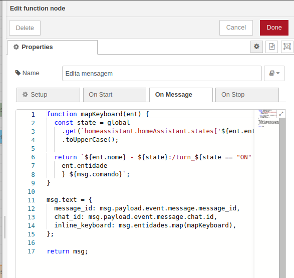

<td style="width: 20%;"></td>
<p><strong><span style="color: #0000ff;">Home Assistant- Telegram</strong></p>
<p><strong><span style="color: #0000ff;">Prof Epaminondas Lage</span></strong></p>
<a href="http://lattes.cnpq.br/7787341723868111"> Currículo Lattes LAGE, E. S.</a></p>
<p><strong><span style="color: #0000ff;">Rodrigo Cézar Luz Brochado</span></strong></p>
<a href="https://www.linkedin.com/in/rodrigo-cezar-luz-brochado/"> Linkedin Rodrigo Cézar Luz Brochado</a>

# Indice

- [Introdução](#Introdução)
- [Instalação](#Instalação)
- [Sites relacionados ao Home Assistant e Telegram ](#Sites-relacionados-ao-Home-Assistant-e-Telegram)
- [Status do Projeto](#Status-do-Projeto)

# Introdução

A integração do Telegram com o Home Assistant é de fato uma ótima maneira de controlar e receber notificações das automações, especialmente quando você está fora de sua rede local e não tem uma VPN configurada. O Telegram é um aplicativo de mensagens amplamente utilizado e confiável, o que o torna uma opção popular para esse tipo de integração.

Utilizar o Node-RED para o desenvolvimento das automações é uma escolha inteligente, pois ele oferece uma abordagem visual para a programação, tornando o processo mais intuitivo e acessível para muitos usuários.

Pré-requisitos para a integração do Telegram com o Home Assistant usando o Node-RED:

- Ter o Home Assistant instalado e funcionando corretamente.
- Ter o Node-RED instalado e configurado em seu Home Assitant.
- Criar um bot no Telegram usando o BotFather e obter o token do bot.

# Instalação

Para criar e configurar o seu primeiro bot do Telegram, siga os passos a seguir:

1. **Crie um bot do telegram:**
   - No aplicativo do Telegram, abra um chat com o @BotFather.
   - Digite /newbot.
   - Siga as instruções na tela e dê um nome ao seu bot.
   - O BotFather fornecerá um link para seu novo bot e um token de API HTTP.
   - Guarde o token em algum lugar seguro. Se for salva-lo em um arquivo dentro de seu projeto, membre-se de nao deixa-lo em um github publico, qualquer um com acesso a esse token pode controlar o seu bot.
2. **Obtenha o seu ID de usuario:**
   - Para obter o ID de conversa do seu usuario, abra um chat com o bot GetIDs.
   - Em seguida, digite /start. O bot retornará seu ID de conversa e nome de usuário.
3. **Associe o seu bot do Telegram ao Home Assistant:**

   - Cole o codigo abaixo no seu **configuration.yaml**. Lembre-se de substituir os valores dos campos **api_key** e **allowed_chat_ids** pelos seus dados obtidos nos passos anteriores.

   ```yaml
   # Telegram Bot
   telegram_bot:
     - platform: polling
       api_key: "1117774004:EABQulCACdgkQOTN3hS_5HZwSwxDlekCixr"
       allowed_chat_ids:
         - 44441111
   ```

4. **Crie um notificador:**

   - Cole o codigo abaixo no seu **configuration.yaml**. Lembre-se de substituir os valores dos campos **name** e **chat_id** pelos seus dados obtidos nos passos anteriores. Este codigo por exemplo, cria o serviço **notify.epaminondas** que envia uma mensagem de telegram para o usuario Epaminondas.

   ```yaml
   # Notifier
   notify:
     - platform: telegram
       name: "epaminondas"
       chat_id: 12345678
   ```

5. **Reinicie o Home Assistant para que as mudanças façam efeito.**
6. **Teste o seu bot:**

   - Na conversa com BotFather, selecione o link para abrir um chat com seu novo bot.
   - Os bots não têm permissão para entrar em contato com os usuários. Você precisa fazer o primeiro contato do usuário para o qual deseja configurar o bot. No chat com o novo bot, digite /start.
   - No Home Assistant, vá para **Ferramentas do desenvolvedor > Serviços > Modo YAML**
   - Cole o codigo abaixo no arquivo YAML. Lembre-se de substituir **notify.epaminondas** pelo serviço de notificação criado anteriormente.

   ```yaml
   service: notify.epaminondas
   data:
     message: "Que legal! Uma messagem do Home Assistant!"
   ```

   - Clique no botão **INICIAR SERVIÇO** para enviar a mensagem.

# Criando o bot

## Nodos uteis do Node RED para esta automação

O Node RED é uma ferramenta muito util para fazer automações no Home Assistant que requerem um nivel maior de complexidade. Através dele podemos descrever visualmente um fluxo complexo e acompanhar visualmente o que ocorre em cada nodo, facilitando o debug de eventuais problemas. Abaixo segue uma lista e breve descrição de nodos uteis do Node RED que serão utilizados neste tutorial, incluindo tanto nodos gerais nativos do Node RED quanto nodos pertencentes à integração com o Home Assistant.

### Nodos gerais

- **change**: utilizado para modificar as propriedades de uma mensagem e definir propriedades de contexto sem a necessidade de recorrer a um nodo **function**.
- **debug**: usado para exibir mensagens na barra lateral Debug dentro do editor. Facilita o entendimento das propriedades das mensagens recebidas e confirmação de que as alterações estão corretas.
- **delay**: adiciona um atraso no fluxo, conglando a execução por um periodo de tempo.
- **function**: permite que a execução de código JavaScript para modificar uma mensagem, facilitando a aplicação de operações complexas.
- **switch**: permite que as mensagens sejam roteadas para diferentes ramificações de um fluxo de acordo com um conjunto de regras.

### Nodos especificos do Home Assistant

- **call_service**: permite o acionamento de um serviço do Home Assistant a partir de um fluxo do Node RED.
- **events: telegram_text**: Recebe eventos do Home Assistant de tipo telegram_text.
- **events: telegram_command**: Recebe eventos do Home Assistant de tipo telegram_command.
- **events: telegram_callback**: Recebe eventos do Home Assistant de tipo telegram_callback.

Nas imagens abaixo podemos ver a estrutura das mensagens recebidas quando os eventos do Telegram são disparados pelo Home Assistant.


Ao receber mensagens simples iniciadas pelo usuario, o evento **telegram_text** é disparado. Como podemos ver na imagem, o texto enviando fica em **msg.payload.event.text**.


Ao receber mensagens iniciadas pelo usuario que comecem com o caracter **/**, o evento **telegram_command** é disparado. Como podemos ver na imagem, o comando enviando fica em **msg.payload.event.command**. Qualquer palavra enviada apos o comando é tratada como um parametro deste comando e é armazenada em um _array_ em **msg.payload.event.args**.


Ao receber mensagens iniciadas a partir de uma interação do usuario com uma ação predeterminada (como clicar em um botão do **inline_keyboard**), o evento **telegram_callback** é disparado. Nesta categoria, a mensagem recebida possui, além dos campos habituais, uma referencia à mensagem que gerou o callback (**msg.payload.event.message.message_id** e msg.payload.event.message.chat.id). Esta referencia pode ser utilizada para editar a mensagem.


Mais detalhes podem ser encontrados na documentação oficial da integração do Telegram com Home assistant: https://www.home-assistant.io/integrations/telegram/

## Automação simples via Telegram

### Utilizando Plain Text

As imagens abaixo mostram um exemplo de automação simples através de mensagens textuais normais. Para toda mensagem recebida, o nodo **switch** verifica se o texto da mensagem corresponde a uma ordem especifica, como **Ligar luz**. Em caso positivo, o fluxo segue em frente e utiliza o nodo **call_service** para ativar um serviço do Home Assistant responsavel por realizar esta ação.


### Utilizando comandos do Telegram

As imagens abaixo mostram um exemplo de automação simples através de mensagens contendo comandos (palavras que comecem com **/**). Para toda mensagem recebida contendo um comando, o nodo **switch** verifica se o comando corresponde a uma ordem especifica, como **/ligar**. Logo em seguida, o fluxo compara o primeiro argumento (palavra apos o comando, separada por espaço) com uma opção pré definida, como **luz**. Em caso positivo para ambos, o fluxo segue em frente e utiliza o nodo **call_service** para ativar um serviço do Home Assistant responsavel por realizar esta ação.


## Automação geral com comandos

Apesar dos exemplos na subseção anterior parecerem similares e não indicarem uma clara vantagem da utilização de comandos do telegram aos invés de instruções textuais, pode-se perceber que a utilização de comandos permite a facil parametrização de uma determinada ação. Os exemplos a seguir fazem uso desta caracteristica para criar uma automação geral.

### Usando Mustache Templates

Ao invés de escrever um fluxo para cada possivel instrução, podemos utilizar o nodo **function** para extrair a ação desejada (fornecida no comando) e a entidade sobre a qual esta ação deve ser realizada (fornecida no primeiro argumento). Esta ação e entidade são armazenadas em **msg.action** e **msg.entities** respectivamente e, em seguida, utiliza-se mustache templates para fornecer esta informação no nodo **call_service** e ativar o serviço do Home Assistant responsavel por realizar esta ação. Para utilizar mustache templates, simplesmente escreva o campo desejado dentro de chaves duplas **{{}}**. Por exemplo, para passar o campo **msg.action** para o serviço, escreva **{{action}}**. Se o campo desejado fosse **msg.payload.event.text**, basta utilizar **{{payload.event.text}}**. Assim, podemos enviar a mensagem **/turn_on switch.switch_sala_1** para ligar a entidade com este nome no Home Assistant por exemplo.


### Usando o nodo change para melhorar a interface de usuario

Por mais que a automação anterior facilite a implementação de novas automações sem a necessidade de criação de novos fluxos, a interface de usuario de torna complexa, uma vez que exige que o usuario saiba exatamente o nome da entidade que sera afetada, o que se torna inviavel à medida que o numero de entidades cresce. Neste caso, uma alternativa é usar o nodo **change** para atribuir um alias às entidades.


## Gerando um callback com Inline Keyboard

Um Inline Keyboard consiste numa lista de strings que são utilizadas para criar um teclado embutido personalizado abaixo da mensagem enviada, com botões associados a um callback. Quando o usuario clica em um dos botões, o nodo **events: telegram_callback** é disparado com a mensagem associada ao botão. O codigo abaixo mostra um exemplo de envio de mensagem com inline keyboard no Home Assistant e a imagem em seguida mostra o que foi recebido no app do Telegram.

```yaml
action:
  service: notify.epaminondas
  data:
    title: "*Mensagem com Inline Keyboard*"
    message: "Este é um exemplo que manda uma mensagem com Inline Keyboard."
    data:
      inline_keyboard:
        - "Task 1:/turn_on switch.switch_sala_1, Task 2:/turn_on switch.switch_sala_2"
        - "Task 3:/turn_on switch.switch_corredor_1, Task 4:/turn_on switch.switch_banheiro_1"
```


Como podemos ver, o resultado foram 4 botões: os botões separados por virgula aparecem na mesma linha enquanto os botões em linhas diferentes aparecem em linhas diferentes. Além disso, podemos observar que a string apos "**:**" não aparece no texto do botão para o usuario. Ela é utilizada para indicar o comando que sera enviado para o callback quando o usuario clica no botão. No exemplo acima, clicar em **Task 3** envia o comando **/turn_on switch.switch_corredor_1** para o nodo **events: telegram_callback**.

Assim, podemos fazer uso da automação geral usando mustache templates mostrada na subseção anterior para criar um callback geral que inicia um serviço baseado no comando e argumento enviados quando o usuario clica no botão do Inline Keyboard.


## Automação geral com comandos e Inline Keyboard

Agora que conseguimos implementar uma automação geral com comandos, utilizar o nodo change para fazer com que o usuario não precise saber de cor o nome de cada entidade e gerar um callback com Inline Keyboard, podemos unir os 3 conceitos para criar uma interface de usuario onde ele pode requisitar um teclado embutido e mudar os estados de uma entidade clicando em seus respectivos botões.

Ao invés de acionar um serviço padrão do Home Assistant (como **homeassistant.turn_on** ou **homeassistant.turn_off**) com o comando inicial, iremos acionar o **telegram_bot.send_message** e modificar o conteudo da mensagem para criar um Inline Keyboard com botões e callbacks que realizem ações pré-definidas de acordo com o comando inicial enviado. O usuario podera então clicar no teclado embutido para acionar um serviço padrão do Home Assistant na entidade associada a cada botão.

O exemplo a seguir cria um fluxo onde um comando pré-definido é avaliado no nodo **switch**. Caso ele seja **/start** é enviada uma mensagem simples de boas vindas, caso ele seja **/get_lights** ou **/get_switches**, é enviada uma mensagem com Inline Keyboard mostrando o estado atual (ON/OFF) das entidades cadastradas naquela categoria. Clicar no botão de uma entidade gera um comando para mudar o estado mostrado na mensagem (se a mensagem mostra **Light 1 - ON**, clicar neste botão enviara o comando **/turn_off light.virtual_fake_light_1**). Por ultimo, o callback geral usando mustache templates mostrado na subseção anterior é usado para realizar este acionamento no Home Assistant.


Abaixo seguem as configurações referentes aos nodos **switch**, **change** e **function**, assim como o acionamento do serviço **telegram_bot.send_message**. O nodo **change** _Configura mensagem_ configura os parametros da mensagem de forma que possam ser facilmente editados e replicados, enquanto o nodo **function** _Gera mensagem_ em seguida formata essa mensagem para que esteja de acordo com o que o **telegram_bot.send_message** espera receber. 3 parametros de configuração são definidos em _Configura mensagem_: **msg.comando** espera uma string que identifique o comando recebido, isso sera importante na proxima subseção; **msg.texto** espera uma string a ser enviada no corpo da mensagem (no exemplo acima, ela é "Here are your lights!!!"); **msg.entidades** espera um JSON contendo uma lista de objetos, cada um contendo os campos **nome** e **entidade** (_nome_ é o nome que sera mostrado no botão do Inline Keyboard, _entidade_ é a entidade que devera ser associada a ele).


```Json
[
    {
        "nome": "Light 1",
        "entidade": "light.virtual_fake_light_1"
    },
    {
        "nome": "Light 2",
        "entidade": "light.virtual_fake_light_2"
    },
    {
        "nome": "Light 3",
        "entidade": "light.virtual_fake_light_3"
    }
]
```


```JavaScript
function mapKeyboard(ent) {
  const state = global
    .get(`homeassistant.homeAssistant.states['${ent.entidade}'].state`)
    .toUpperCase();

  return `${ent.nome} - ${state}:/turn_${state == "ON" ? "off" : "on"} ${
    ent.entidade
  } ${msg.comando}`;
}

msg.text = {
  message: msg.texto,
  inline_keyboard: msg.entidades.map(mapKeyboard),
  message_tag: `msg_${msg.comando}`,
};

return msg;
```


### Melhorando o feedback de usuario via edição de mensagens

O exemplo acima é bastante util, uma vez que permite que o usuario final interaja com diversas entidades com apenas um comando e cliques de botões, sem a necessidade de memorizar nomes de entidades ou mesmo saber o funcionamento interno do Home Assistant (como serviços associados às entidades). Contudo, ele possui uma falha significativa: uma vez que o usuario clica em um botão para realizar uma ação, ele não tem um feedback de se a ação foi de fato realizada. Seria necessario ao usuario enviar novamente o comando /get_lights por exemplo para receber uma nova mensagem com os estados atualizados das entidades. Para resolver isso, podemos utilizar o serviço **telegram_bot.edit_replymarkup** para editar o Inline Keyboard de uma mensagem uma vez que o callback associado a ela seja executado.

No exemplo abaixo, além de acionar o serviço do Home Assistant para realizar a ação configurada, um segundo fluxo é adicionado para realizar a edição do Inline Keyboard. Nele, um delay de 2s é adicionado para garantir que o Home assistant teve tempo de realizar a ação e, em seguida, um **switch** é utilizado para identificar o comando que gerou o Inline Keyboard (definido em **msg.comando** na subseção anterior). Um nodo **change** é então utilizado para configurar a edição do Inline Keyboard de modo similar ao ocorrido na seção anterior e o nodo **function** _Edita mensagem_ em seguida formata essa mensagem para que esteja de acordo com o que o **telegram_bot.edit_replymarkup** espera receber. Para diferenciar entre diferentes mensagens e garantir que a mensagem correta seja editada, utiliza-se o ID do chat e da mensagem recebidos.

Assim, o fluxo espera um tempo espera um tempo para garantir que o Home assistant teve tempo de realizar a ação e edita o Inline Keyboard para que esteja contenha os estados atualizados das entidades e comandos atualizados para modifica-las. Por exemplo, clicar no botão que mostra **Light 1 - ON** enviara o comando **/turn_off light.virtual_fake_light_1** para o callback, esta ação sera realizada pelo Home Assistant e o botão sera atualizado para conter o texto **Light 1 - OFF** e comando associado **/turn_on light.virtual_fake_light_1**.


```Json
[
    {
        "nome": "Light 1",
        "entidade": "light.virtual_fake_light_1"
    },
    {
        "nome": "Light 2",
        "entidade": "light.virtual_fake_light_2"
    },
    {
        "nome": "Light 3",
        "entidade": "light.virtual_fake_light_3"
    }
]
```



```JavaScript
function mapKeyboard(ent) {
  const state = global
    .get(`homeassistant.homeAssistant.states['${ent.entidade}'].state`)
    .toUpperCase();

  return `${ent.nome} - ${state}:/turn_${state == "ON" ? "off" : "on"} ${
    ent.entidade
    } ${msg.comando}`;
}

msg.text = {
  message_id: msg.payload.event.message.message_id,
  chat_id: msg.payload.event.message.chat.id,
  inline_keyboard: msg.entidades.map(mapKeyboard),
};

return msg;
```


## Juntando tudo

A imagem abaixo mostra o fluxo completo discutido neste tutorial. Este fluxo esta presente no repositorio no arquivo [**flowTelegram.json**](flowTelegram.json) e pode ser importado diretamente no Node RED para ser editado e utilizado. Além disso, fotos de todas as configurações de nodos utilizados no fluxo completo encontram-se em [imagens/final/](imagens/final).


# Sites relacionados ao Home Assistant e Telegram

- Documentação oficial da integração do Telegram com Home assistant: https://www.home-assistant.io/integrations/telegram/
- Documentação oficial dos serviços de notificação do Telegram com Home assistant: https://www.home-assistant.io/integrations/telegram_bot
- Documentação do **node-red-contrib-home-assistant-websocket** (modulo do Home Assistant para Node RED): https://zachowj.github.io/node-red-contrib-home-assistant-websocket/guide/

# Status do Projeto


